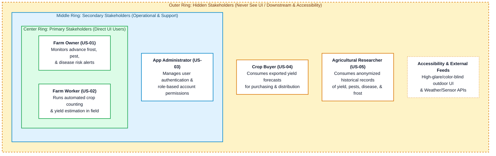

```mermaid
flowchart TB
    subgraph Outer ["Outer Ring: Hidden Stakeholders (Never See UI / Downstream & Accessibility)"]
        direction TB
        H1["<b>Crop Buyer (US-04)</b><br/>Consumes exported yield forecasts<br/>for purchasing & distribution"]
        H2["<b>Agricultural Researcher (US-05)</b><br/>Consumes anonymized historical records<br/>of yield, pests, disease, & frost"]
        H3["<b>Accessibility & External Feeds</b><br/>High-glare/color-blind outdoor UI<br/>& Weather/Sensor APIs"]

        subgraph Middle ["Middle Ring: Secondary Stakeholders (Operational & Support)"]
            direction TB
            S1["<b>App Administrator (US-03)</b><br/>Manages user authentication &<br/>role-based account permissions"]

            subgraph Center ["Center Ring: Primary Stakeholders (Direct UI Users)"]
                direction LR
                P1["<b>Farm Owner (US-01)</b><br/>Monitors advance frost, pest,<br/>& disease risk alerts"]
                P2["<b>Farm Worker (US-02)</b><br/>Runs automated crop counting<br/>& yield estimation in field"]
            end
        end
    end

    style Outer fill:#fef3c7,stroke:#d97706,stroke-width:2px,stroke-dasharray: 5 5,color:#78350f
    style Middle fill:#e0f2fe,stroke:#0284c7,stroke-width:2px,color:#0c4a6e
    style Center fill:#dcfce7,stroke:#16a34a,stroke-width:2px,color:#14532d
    style P1 fill:#ffffff,stroke:#16a34a,stroke-width:2px,color:#0f172a
    style P2 fill:#ffffff,stroke:#16a34a,stroke-width:2px,color:#0f172a
    style S1 fill:#ffffff,stroke:#0284c7,stroke-width:2px,color:#0f172a
    style H1 fill:#ffffff,stroke:#d97706,stroke-width:2px,color:#0f172a
    style H2 fill:#ffffff,stroke:#d97706,stroke-width:2px,color:#0f172a
    style H3 fill:#ffffff,stroke:#d97706,stroke-width:1px,stroke-dasharray: 3 3,color:#0f172a
```
